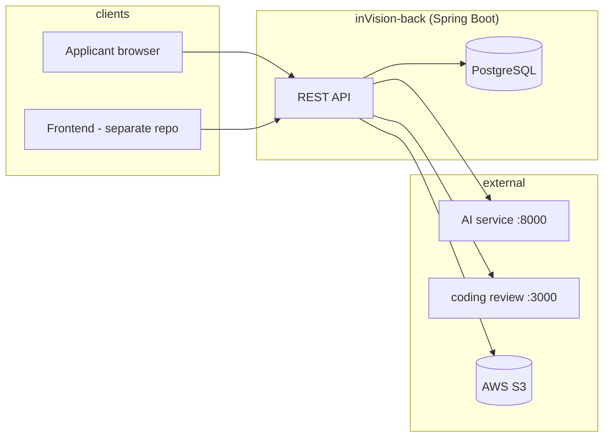

# Intelligent Candidate Selection Support — inVision U (Backend API)

**One-line pitch:** A Spring Boot API that helps inVision U **screen** applications faster: applicants submit a structured form and documents; an external AI service scores CV and essay; a chatbot interview is proxied and stored; reviewers use a JWT-protected dashboard with per-dimension scores, evidence highlights with reasons, optional Codeforces/LeetCode enrichment, and status updates — **supporting initial triage, not final admission decisions.**

---

## What it does for admissions

The system **does not** replace human judgment. It aggregates structured application data, AI-derived signals (document scores, interview dimensions), exam-style inputs (UNT, IELTS, TOEFL), and optional competitive-programming profiles into **explainable summaries** so staff can prioritize and review candidates. Final accept/reject remains a human process.

---

## Problem & value

Manual review of growing application volumes is slow and inconsistent. The hackathon TOR emphasizes **scale**, **explainability**, and **human-in-the-loop** design. This backend centralizes submission storage, calls an AI evaluator for document analysis, stores interview outcomes, and exposes **dashboard APIs** so a separate UI can show scores, evidence quotes, AI-generated reasons, and coding-platform breakdowns without recomputing scoring logic on the client.

---

## What we built (this repository)

- **Applicant flow**
  - **Draft:** `POST /api/forms/draft` — JSON body with `fieldOfStudy`; returns `id` immediately (status `DRAFT`).
  - **Submit:** `POST /api/forms/{id}/submit` — multipart with personal data, **UNT / IELTS / TOEFL**, optional **Codeforces / LeetCode / GitHub / LinkedIn** handles, CV PDF, essay PDF, intro video. Triggers AI evaluation, S3 uploads, persistence of `CVReview` and `EssayReview`; status moves to `PENDING`.
- **Chatbot interview (if AI service is up):** `POST /api/interview/start` and `POST /api/interview/{sessionId}/reply` — proxied to the configured AI base URL; results stored for dashboard linking.
- **Admin dashboard (JWT)**
  - Candidate **list** (leaderboard-style data).
  - **Candidate detail** (full form fields + exam + social handles).
  - **Tabs / resources the frontend would call:** `score-overview`, `cv-review`, `essay-review`, `chatbot-analysis`, `extra` (social handles), `coding-review` (Codeforces/LeetCode via separate Node service, cached in DB).
- **Scoring surfaces**
  - **Overall** candidate score used in list/overview combines averaged dimension scores (CV, essay, chatbot where present), exam band points, and cached Codeforces/LeetCode `final_score` when available. Logic lives in `DashboardService` (e.g. `computeAggregateOverAllScore`, `getScoreOverview`).
  - **Per-dimension** scores (leadership, proactiveness, energy) from AI JSON (`*_score` fields) stored on reviews and interview results.
- **Explainability**
  - CV/essay responses include **highlights** with `text`, `reason` (from AI `evidence_comments`), and `sentiment`.
  - Essay **possible AI-generated** flag when provided by AI.
  - Coding review returns structured **proactiveness / skill breakdown** from the external review service (stored as raw JSON).

---

## Architecture

This repo is the **API + persistence** layer. The **AI document evaluator** and **interview** flows are expected at `ai.evaluator.base-url` (default from env). **Codeforces/LeetCode** enrichment calls a **separate HTTP service** currently hardcoded to `http://localhost:3000/review/{platform}/{handle}` in `DashboardService` (not configurable via `application.yaml` in this tree).



| Area | Location in repo |
|------|------------------|
| REST controllers | `src/main/java/com/u/invision/controller/` |
| Business logic | `src/main/java/com/u/invision/service/` |
| JPA entities | `src/main/java/com/u/invision/entity/` |
| Security / JWT | `src/main/java/com/u/invision/config/`, `security/` |

**Frontend:** Not present in this repository. If your team ships `inVision-front` (e.g. React + Vite), clone it separately and point it at `http://localhost:8080` (or your deployed API).

---

## Tech stack (verified)

| Layer | Technology |
|-------|------------|
| Runtime | Java **21** (Gradle toolchain) |
| Framework | Spring Boot **4.0.5** |
| API | Spring Web, Validation, Actuator |
| Security | Spring Security + **JWT** (jjwt) |
| Persistence | Spring Data JPA, Hibernate, **PostgreSQL** |
| Docs | springdoc-openapi **2.7** → Swagger UI |
| Storage | AWS SDK v2 **S3** |
| Documents | Apache PDFBox **3.0.4** (PDF → text / TeX snippet for dashboard) |
| HTTP client | `RestTemplate` to AI evaluator |

---

## Prerequisites

- **JDK 21**
- **PostgreSQL** (empty database; Hibernate `ddl-auto: update` creates/updates schema)
- **AWS credentials** with access to the configured S3 bucket (for real uploads)
- **AI evaluator** reachable at the URL in `AI_EVALUATOR_BASE_URL` (see below)
- **Optional:** Node service on port **3000** for `/review/codeforces/{handle}` and `/review/leetcode/{handle}` if you use **coding-review** caching

**Docker:** Not required by this repo; you may run Postgres via Docker locally if you prefer.

---

## How to run locally (~15 minutes)

### 1. Clone

```bash
git clone <your-repo-url>
cd inVision-back
```

### 2. Environment variables

Create a shell env or `application-local.yaml` (gitignored) with at least:

| Variable | Required | Example | Purpose |
|----------|----------|---------|---------|
| `POSTGRES_URL` | Yes | `jdbc:postgresql://localhost:5432/invision` | JDBC URL |
| `POSTGRES_SECRET` | Yes | `your-db-password` | DB password (`username` defaults to `postgres` in `application.yaml`) |
| `JWT_SECRET` | Yes | long random string | JWT signing |
| `AWS_ACCESS_KEY` | Yes* | AWS key | S3 uploads |
| `AWS_SECRET_KEY` | Yes* | AWS secret | S3 uploads |
| `AI_EVALUATOR_BASE_URL` | Yes** | `http://127.0.0.1:8000` | Document + interview AI |

\*Required for full submit flow with uploads.  
\*\*Required for `POST /api/forms/{id}/submit` and interview proxying to succeed.

Optional overrides (defaults exist in `application.yaml` for bucket/region):

- `aws.s3.bucket-name`, `aws.region` — only if you change S3 target.

### 3. Start backend

```bash
./gradlew bootRun
```

- Default port: **8080**
- Swagger: `http://localhost:8080/swagger-ui.html`
- OpenAPI JSON: `http://localhost:8080/v3/api-docs`

### 4. Create a reviewer user

Use your existing seed/migration or insert a `User` row matching `AuthController` expectations, then:

```http
POST http://localhost:8080/api/auth/login
Content-Type: application/json

{ "username": "<email>", "password": "<password>" }
```

Use `Authorization: Bearer <token>` on all `/api/dashboard/**` requests.

### 5. Frontend (if you have a separate repo)

This repo has **no** `package.json`. For a React/Vite app elsewhere:

```bash
cd ../inVision-front   # example path
npm install
npm run dev
```

Set `VITE_API_BASE_URL` (or your project’s equivalent) to `http://localhost:8080` unless you use a dev proxy.

**Mock data:** There is **no** `USE_MOCK_DATA` (or similar) flag in this backend repository. To demo without AI/S3, you would need to stub services or use only read endpoints against pre-seeded data — not shipped here.

---

## API overview (high level)

| Method | Path | Purpose |
|--------|------|---------|
| `POST` | `/api/auth/login` | JWT for dashboard |
| `POST` | `/api/forms/draft` | Create draft application |
| `POST` | `/api/forms/{id}/submit` | Multipart submit + AI + S3 + reviews |
| `POST` | `/api/interview/start` | Start chatbot session (proxied) |
| `POST` | `/api/interview/{sessionId}/reply` | Send reply (proxied) |
| `GET` | `/api/dashboard/candidates` | List candidates (both reviews present) |
| `GET` | `/api/dashboard/candidates/{id}` | Full form detail |
| `GET` | `/api/dashboard/candidates/{id}/score-overview` | Aggregated score breakdown + exams + coding scores |
| `GET` | `/api/dashboard/candidates/{id}/coding-review` | Codeforces/LeetCode analysis (fetch/cache) |
| `GET` | `/api/dashboard/candidates/{id}/cv-review` | TeX text, PDF URL, highlights + criteria |
| `GET` | `/api/dashboard/candidates/{id}/essay-review` | Same for essay |
| `GET` | `/api/dashboard/candidates/{id}/chatbot-analysis` | Interview transcript + scores |
| `GET` | `/api/dashboard/candidates/{id}/extra` | Social handles snapshot |
| `PATCH` | `/api/dashboard/candidates/{id}/status` | `PENDING` / `ACCEPTED` / `REJECTED` |

**DTO details:** Use Swagger UI or `v3/api-docs` — no separate `docs/api.md` in this repo.

---

## Data & privacy

- **Processed data** includes identity and education fields, exam scores (UNT, IELTS, TOEFL), optional public profile handles, uploaded PDFs and video URLs (S3), AI outputs (scores, evidence lines, comments), and interview transcripts/scores stored in PostgreSQL.
- **AI and automation do not make binding admission decisions** in this design; they surface signals for reviewers.
- **Admin routes** are JWT-protected; public applicant routes are intentionally open for `/api/forms/**` and `/api/interview/**` per security config — adjust for production.
- **Gaps for production:** encryption at rest for sensitive columns, retention/deletion policy, audit logging, rate limiting, secrets management, and making the coding-review base URL configurable are not fully addressed in this codebase.

---

## Scoring & explainability (honest)

- **Model-based:** CV and essay dimension scores and evidence text come from the **external AI** service; the backend persists and forwards them.
- **Rule-based / heuristic:** Exam banding (UNT, IELTS, TOEFL), aggregation of averages into list/overview totals, and inclusion of cached Codeforces/LeetCode `final_score` are implemented in **`DashboardService`** (Java), not recomputed in the UI.
- The UI should **display** backend-provided scores and `reason` fields; final formulas are not intended to be duplicated on the client.

---

## Baselines & validation

**Not included in this repository:** labeled datasets, offline evaluation notebooks, or automated tests that score ranking quality against human labels.

**Reasonable next steps:** a small human-rated validation set, agreement metrics vs. a simple baseline (e.g. exam-only rank), and regression tests for aggregation helpers in `DashboardService`.

**Existing tests:** `./gradlew test` runs Spring Boot’s default test scaffold; there is no dedicated scoring test suite referenced in `build.gradle.kts`.

---

## Demo script (judges, ~5–7 steps)

1. Start PostgreSQL, set env vars, run `./gradlew bootRun`.
2. Open Swagger → **Authorize** with JWT from `POST /api/auth/login`.
3. **`GET /api/dashboard/candidates`** — show list with overall score.
4. Pick an id → **`GET /api/dashboard/candidates/{id}`** — profile + exams + handles.
5. **`GET .../score-overview`** — breakdown (CV / essay / chat / exams / coding).
6. **`GET .../cv-review`** or **`.../essay-review`** — scroll highlights with **reasons**.
7. Optionally **`GET .../coding-review`** (with Node service on :3000) and **`.../chatbot-analysis`** if interview data exists.

---

## Limitations & roadmap

- **Frontend** is not in this repo; demo assumes a separate UI or Swagger.
- **Coding service URL** is hardcoded to `http://localhost:3000` in code — should be configuration.
- **`scripts/postgres-allow-draft-nulls.sql`** was referenced in an older README; that path is **not** present in the current tree — legacy DBs may need manual `ALTER TABLE` for `DRAFT` and nullable columns.
- **Telegram bot**, proactive sourcing, and full production hardening are **out of scope** for this snapshot.
- **AI service contract** has evolved (e.g. `leadership_score` vs. older field names); operators must keep AI and backend DTOs aligned.

---

## Build

```bash
./gradlew build
```

---

## License / hackathon

- **Hackathon:** Decentrathon 5.0 — AI inDrive track (inVision U intelligent screening support).
- **Team / demo video / license:** Add your team name, video link, and license file if required by the event.

---

*Repository: `inVision-back` — Spring Boot API only.*
